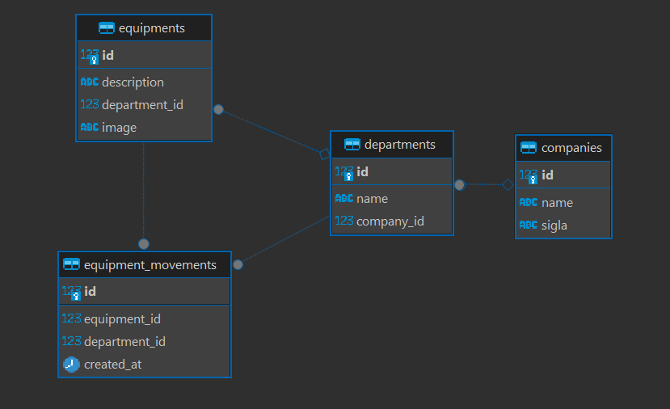

# Bem-vindo ao TombaAqui!

O projeto envolve um microserviço dedicado à autenticação e um sistema separado para gerenciamento de tombamentos.

## Projeto Principal: 

### Microserviço de Autenticação
- **Descrição**: Este microserviço é responsável pela autenticação de usuários utilizando JWT (JSON Web Tokens). Ele garante uma autenticação segura e eficiente para a comunicação entre diferentes partes do sistema.
- **Tecnologias Utilizadas**:
  - **Python**: Linguagem de programação principal.
  - **SQLAlchemy**: ORM (Object-Relational Mapping) utilizado para gerenciar e interagir com o banco de dados relacional.
  - **FastAPI**: Framework web moderno para construir APIs rápidas.
  - **JWT**: Para autenticação segura.
  - **Docker**: Para containerização.

### Sistema de Gerenciamento de Tombamentos
- **Descrição**: Este projeto é responsável por gerenciar o processo de tombamento de equipamentos. Ele fornece as rotas necessárias para registrar e acompanhar a movimentação dos equipamentos.
- **Tecnologias Utilizadas**:
  - **Python**: Linguagem de programação.
  - **FastAPI**: Framework web para construção das APIs.
  - **SQLAlchemy**: ORM (Object-Relational Mapping) utilizado para gerenciar e interagir com o banco de dados relacional.
  - **PostgreSQL**: Banco de dados relacional utilizado para armazenar informações.

## Diagrama Relacional - TombaAqui

Abaixo está o diagrama relacional do banco de dados utilizado no projeto:

## Diagrama de Usuários (MS-Authentication)

### Tabela: `users`

| Nome do Campo | Tipo de Dados | Descrição                       |
|---------------|---------------|---------------------------------|
| `id`          | INTEGER       | Identificador único do usuário (PK) |
| `username`    | VARCHAR(255)  | Nome de usuário (único)          |
| `password`    | VARCHAR(255)  | Senha do usuário                 |

**PK**: Chave Primária

---
